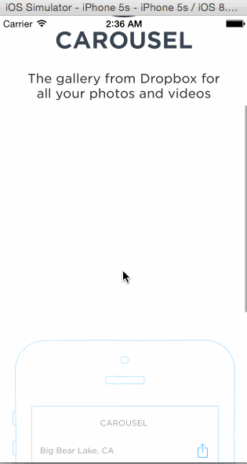

# HW2CodePathCarousel

Homework 2 CodePath: Carousel Project

This is an iOS demo that creates an example app that uses XCode and Swift to create sign in, error, and scroll flows based on an example app (Carousel).  I utilized the example step by step Tutorials in the [CodePath Week 2 Project Folder] (http://courses.codepath.com/courses/ios_for_designers/unit/2#!assignment) to create this app.  

Time spent: ~6 hours developing required pieces

Completed user stories:
* [x] Required: User can scroll in the initial screen 
* [x] Required: User can Sign In
  * Tapping on email/password reveals the keyboard and shifts the scrollview and Sign In button up.
  * Upon tapping the Sign In button.
    * If the username or password fields are empty, user sees an error alert.
    * If credentials are incorrect, user sees a loading indicator for 2 seconds followed by an error alert.
    * If the credentials are correct, user sees a loading indicator for 2 seconds followed by a transition to the Sign In screens.
* [x] Required: User can Swipe through Tutorial Screens
  * User can page between the screens
* [x] Required: User can scroll through an Image Timeline screen after signing in and navigate from this page
  * User can tap on the conversations button to see the conversations screen (push).
  * User can tap on the profile image to see the settings view (modal from below).
* [x] Required: User can access a Connversations screen and dismiss the conversations screen to navigate back to the Image Timeline screen
* [x] Required: User can access a Settings screen and dismiss the settings to navigate back to the Image Timeline screen
  * User can log out

GIF created with [LiceCap](http://www.cockos.com/licecap/).
